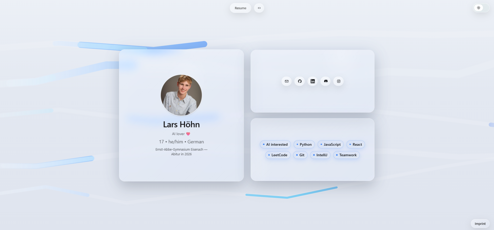

## liquid-glass-card

One-screen personal web card built with React (Vite), TailwindCSS, Framer Motion, and a liquid glass aesthetic.

- Live: https://cardpagelarshoehn.netlify.app/

### Preview



### Stack
- React + Vite + TypeScript
- TailwindCSS
- Framer Motion

### Development
```
npm install
npm run dev
```

